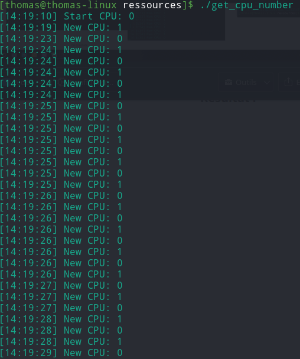

# PTR : labo 1 - rapport

**Thomas Rieder**

## 1ères mesures

### 5. Compter le nombre d'opération * et / sur une donnée de type float

#### 1. Division

```c
#define n_sec   1
#define n_op    10

int main(void) {

    time_t start_time;
    int nb_it;
    float data;
    double nb_it_avg = 0;

    //répète n_op x afin de faire une moyenne
    for (int i = 0; i < n_op; i++) {

        nb_it = 0;
        data = 1000;
        
        start_time = time(NULL);

        while(time(NULL) < (start_time + n_sec)) {

            data = data / 2;

            ++nb_it;
        }

        nb_it_avg += (double)nb_it;

    }

    nb_it_avg /= n_op;

    printf("avg nb de division: %f\n", nb_it_avg);

    return EXIT_SUCCESS;
}
```

```
avg nb de division: 215545040.200000
```


#### 2. Multiplication

```c
#define n_sec   1
#define n_op    10

int main(void) {

    time_t start_time;
    int nb_it;
    float data;
    double nb_it_avg = 0;

    //répète n_op x afin de faire une moyenne
    for (int i = 0; i < n_op; i++) {

        nb_it = 0;
        data = 1000;
        
        start_time = time(NULL);

        while(time(NULL) < (start_time + n_sec)) {

            data = data * 2;

            ++nb_it;
        }

        nb_it_avg += (double)nb_it;

    }

    nb_it_avg /= n_op;

    printf("avg nb de multiplication: %f\n", nb_it_avg);

    return EXIT_SUCCESS;
}
```

```
avg nb de multiplication: 390159551.100000
```

### 6. Avec les arguments -O2 et -O3

Ces arguments permettent de "doubler" le nombre d'opération, nous obtenons ainsi **432357084** division au lieu **215545040** sans un de ces arguments, ce qui ne fait un rapport de **2.0058**

Pour la multiplication, nous obtenons **437702884** au lieu de **332757403** et donc un rapport de **1.3153**

Cependant, je ne remarque pas de différence sur le nombre d'opération selon l'argument utilisé (-O2 ou -O3).


## Multi-tâche : Commandes utiles

###### Que signifient les lettres et symboles de la colonne `STAT` ?

Elles nous informe sur l'état actuel du precessus, trouvé dans la page **man** de la commande `ps` :

```
D    uninterruptible sleep (usually IO)
I    Idle kernel thread
R    running or runnable (on run queue)
S    interruptible sleep (waiting for an event to complete)
T    stopped by job control signal
t    stopped by debugger during the tracing
W    paging (not valid since the 2.6.xx kernel)
X    dead (should never be seen)
Z    defunct ("zombie") process, terminated but not reaped by its parent

<    high-priority (not nice to other users)
N    low-priority (nice to other users)
L    has pages locked into memory (for real-time and custom IO)
s    is a session leader
l    is multi-threaded (using CLONE_THREAD, like NPTL pthreads do)
+    is in the foreground process group
```

## Ordonnancement en temps partagé

En utilisant un seul CPU à l'aide de la commande `taskset -pc 0` on constate que le nombre d'opération est bien divisé par 2 quand nous lançons 2 fois le programme. Le nombre d'opération se divisent par le nombre de processus lancé.


###### Si vous ouvrez 2 shells et utilisez la même commande taskset dans chacun. Quel résultat obtenez-vous ? Pourquoi ?

Le nombre d'opération se divisent comme précédement car nous décidons d'utiliser le même CPU.

## Migration de tâches

**get_cpu_number.c**

```c
#define _GNU_SOURCE

#include <stdio.h>
#include <stdlib.h>
#include <unistd.h>
#include <sched.h>
#include <time.h>


void print_time() {
    time_t rawtime;
    struct tm * timeinfo;

    time ( &rawtime );
    timeinfo = localtime ( &rawtime );

    printf("[%d:%d:%d] ", timeinfo->tm_hour, timeinfo->tm_min, timeinfo->tm_sec);
}

int main(void) {

    int curr_cpu = sched_getcpu();
    int tmp_cpu;

    print_time();
    printf("Start CPU: %d\n", curr_cpu);


    while(1) {

        tmp_cpu = sched_getcpu();

        //si le nouveau cpu à changé
        if(tmp_cpu != curr_cpu) {

            //récupère le nouveau CPU
            curr_cpu = sched_getcpu();

            //print l'heure et le nouvea CPU
            print_time();
            printf("New CPU: %d\n",  curr_cpu);
        }
    }

    return EXIT_SUCCESS;
}
```


### Test de migration de tâche

- get_cpu_number
  - CPU utilisé : **0, 1**
  - heure de lancement : **14:19:10**
- cpu_loop (1)
  - CPU utilisé : **0**
  - heure de lancement : **14:19:19**

- cpu_loop (2)
  - CPU utilisé : **1**
  - heure de lancement : **14:19:23**

#### Résultat :



On constate que tant qu'un des 2 CPU disponible pour le processus **get_cpu_number** est libre, sans problème, le processus choisira celui qui est libre, par contre quand les 2 CPU sont utilisé par d'autre processus, le programme **get_cpu_number** n'arrive pas à choisir et balance entre les 2 à une fréquence assez élevée.

## Les priorités et niceness


```shell
# $ nice -n 5 ./cpu_loop & ./cpu_loop
avg nb de multiplication: 173336213.700000
avg nb de multiplication: 56490529.100000

# $ ./cpu_loop & ./cpu_loop
avg nb de multiplication: 118782973.500000
avg nb de multiplication: 118559935.600000
```

On constate qu'en utilisant `nice -n 5` un des 2 processus à effectué beaucoup moins d'opération que l'autre (il s'est fait exempter plus souvent)

## Codage

###### Quelles sont les différences entre niceness et priorités ?

**niceness** est utilisé pour les programmes côté utilisateur, elles peuvent prendre uniquement des valeurs de basse priorité laissant ainsi les valeurs les plus prioritaires pour les priorités.