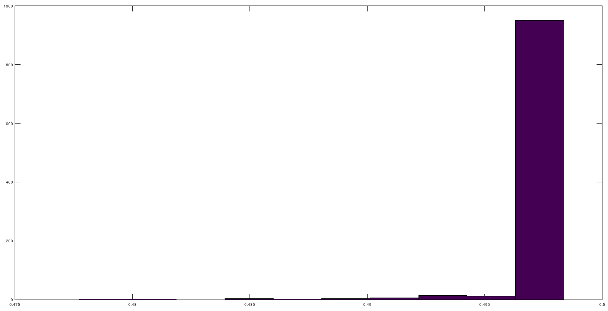
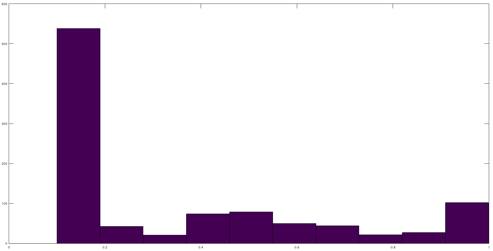

 

# PTR : labo 2

**Thomas Rieder**

## Développement

### Code

```c
#include <stdio.h>
#include <stdlib.h>
#include <unistd.h>
#include <sys/time.h>

#define NB_MESURES 30


int main (int argc, char **argv)
{
    struct timeval tv;
    int i;

    for (i = 0; i < NB_MESURES; ++i) {
        gettimeofday(&tv, NULL);
        printf("%2d : %ld.%06ld\n", i, tv.tv_sec, tv.tv_usec);
    }

    return EXIT_SUCCESS;
}
```


## Modification

### Code

```c
#include <stdio.h>
#include <stdlib.h>
#include <unistd.h>
#include <sys/time.h>

#define NB_MESURES 30


int main (int argc, char **argv)
{
    struct timeval tv[NB_MESURES];
    int i;

    for (i = 0; i < NB_MESURES; ++i) {
        gettimeofday(tv + i, NULL);
    }

    for(i = 0; i < NB_MESURES; ++i) {
        printf("%2d : %ld.%06ld\n", i, tv[i].tv_sec, tv[i].tv_usec);
    }
    
    return EXIT_SUCCESS;
}
```

### 3. Comparer les résultats

```shell
# gettimeofday
 0 : 1601551673.574935
 1 : 1601551673.575067
 2 : 1601551673.575068
 3 : 1601551673.575069
 4 : 1601551673.575069
 5 : 1601551673.575070
 6 : 1601551673.575070
 7 : 1601551673.575071
 8 : 1601551673.575071
 9 : 1601551673.575072
10 : 1601551673.575072
11 : 1601551673.575073
12 : 1601551673.575073
13 : 1601551673.575074
14 : 1601551673.575074
15 : 1601551673.575075
16 : 1601551673.575075
17 : 1601551673.575076
18 : 1601551673.575076
19 : 1601551673.575076
20 : 1601551673.575077
21 : 1601551673.575077
22 : 1601551673.575078
23 : 1601551673.575078
24 : 1601551673.575079
25 : 1601551673.575079
26 : 1601551673.575080
27 : 1601551673.575080
28 : 1601551673.575080
29 : 1601551673.575081

#gettimeofday2
 0 : 1601551936.612962
 1 : 1601551936.612962
 2 : 1601551936.612962
 3 : 1601551936.612962
 4 : 1601551936.612962
 5 : 1601551936.612962
 6 : 1601551936.612962
 7 : 1601551936.612962
 8 : 1601551936.612962
 9 : 1601551936.612963
10 : 1601551936.612963
11 : 1601551936.612963
12 : 1601551936.612963
13 : 1601551936.612963
14 : 1601551936.612963
15 : 1601551936.612963
16 : 1601551936.612963
17 : 1601551936.612963
18 : 1601551936.612963
19 : 1601551936.612963
20 : 1601551936.612963
21 : 1601551936.612963
22 : 1601551936.612963
23 : 1601551936.612963
24 : 1601551936.612963
25 : 1601551936.612963
26 : 1601551936.612963
27 : 1601551936.612963
28 : 1601551936.612964
29 : 1601551936.612964

```

### 4. Expliquer les différences

Les valeurs de **gettimeofday2** ont beaucoup plus proches les une des autres car nous initialisons les valeurs dans les structures directement à la suite. Pour **gettimeofday**, nous faisons un printf avant d'initialiaser la prochaine valeur nous perdons donc du temps entre l'initialisation de la prochaine valeur.

### 5. Quelle est la granularité de la fonction gettimeofday

Les microseconde sont l'untié la plus précise de cette fonction.

## Horloge Posix

### Code

```c
#include <stdio.h>
#include <stdlib.h>
#include <unistd.h>
#include <time.h>

#define NB_MESURES 30


int main (int argc, char **argv)
{
    struct timespec tv;
    struct timespec tv_res;
    int i;

    //get la résolution de cette clock
    clock_getres(CLOCK_REALTIME, &tv_res);

    printf("Resolution : %ld.%06ld\n", tv_res.tv_sec, tv_res.tv_nsec);

    for (i = 0; i < NB_MESURES; ++i) {

        //get current time
        clock_gettime(CLOCK_REALTIME, &tv);
        printf("%2d : %ld.%06ld\n", i, tv.tv_sec, tv.tv_nsec);
    }

    return EXIT_SUCCESS;
}
```

### Comparer la précision de gettimeofday et horloge posix

**gettimeofday** avait une précision en microseconde et els **horloges posix** en nanoseconde


## Développement : timers

### Comment fonction ce programme

Il crée une action appelant la fonction **timer_handler** lorsque un signal **SIGVTALRM** est détecté. Ce signal  se déclanche lorsqu'un timer est arrivé à expiration grâce au paramètre **ITIMER_VIRTUAL**. Le timer est paramèter pour expirer toute les 250ms.

### Modification

Mon programme prend en entrée des milliseconde et non des microsecondes

```c
#include <signal.h>
#include <stdio.h>
#include <stdlib.h>
#include <string.h>
#include <sys/time.h>
#include <time.h>

timer_t timer;
int nbr_mesure;

void timer_handler (int signum) {
    
    static int count = 0;

    struct itimerspec currSpec;

    timer_gettime(timer, &currSpec);

    //print s:ms:ns
    //printf ("%d:%d:%d\n", currSpec.it_value.tv_sec, ((currSpec.it_value.tv_nsec / 1000) % 1000), (currSpec.it_value.tv_nsec % 1000));

    //print s.ns for summary1.c
    printf("%d.%d\n", currSpec.it_value.tv_sec, currSpec.it_value.tv_nsec);

    count++;

    if(count == nbr_mesure) {
        //printf("END\n");
        exit(EXIT_SUCCESS);
    }
}


int main (int argc, char **argv) {

    long int sec;
    long int msec;
    long int nsec;

    struct sigevent event;
    struct itimerspec spec;

    if (argc < 3) {
        
        printf("Usage : %s <nbr mesure> <ms>\n", argv[0]);
        return EXIT_FAILURE;
    }

    nbr_mesure = strtol(argv[1], NULL, 10);
    //msec = strtol(argv[2], NULL, 10);
    msec = strtod(argv[2], NULL);

    //printf("RUN WITH : %d - %d\n", nbr_mesure, msec);


    //sigevent initialisation
    signal(SIGRTMIN, timer_handler);

    //signifie qu'un signal (SIGRTMIN) sera déclencher
    //à la fin du timer
    event.sigev_notify = SIGEV_SIGNAL;
    event.sigev_signo = SIGRTMIN;
    
    sec = msec / 1000;
    nsec = (msec * 1000) % 1000000;
    
    //initie l'intervale
    spec.it_interval.tv_sec = sec;
    spec.it_interval.tv_nsec = nsec;
    spec.it_value = spec.it_interval;


    //printf("%dsec, %dnsec\n", spec.it_interval.tv_sec, spec.it_interval.tv_nsec);

    //printf("[s:ms:ns]\n");

    //crée le timer
    if(timer_create(CLOCK_REALTIME, &event, &timer) < 0) {

        printf("FAILDE CREATE TIMER\n");
        //return EXIT_FAILURE;
    }

    //programme le timer
    if(timer_settime(timer, 0, &spec, NULL) < 0) {

        printf("FAILDE SET TIMER\n");
        //return EXIT_FAILURE;
    }

    while(1);

    return EXIT_SUCCESS;

}

```


## Mesures

#### Pour une intervalle de 500 ms

```
---------------------------------------------- summary1.c -----
  Total of 1000 values 
    Minimum  = 0.477754 (position = 561) 
    Maximum  = 0.498365 (position = 887) 
    Sum      = 497.837930 
    Mean     = 0.497838 
    Variance = 0.000004 
    Std Dev  = 0.001955 
    CoV      = 0.003927 
---------------------------------------------------------------
```

Nous avons une gigue (variation de latence) de 0.000004, ce que nous visualisons assez bien avec l'histogramme générer avec Octave :



La grande majorité des valeurs se trouvent au dessus de 0.495.


#### Pour une intervalle de 1 ms

```
---------------------------------------------- summary1.c -----
  Total of 1000 values 
    Minimum  = 0.100000 (position = 999) 
    Maximum  = 0.999000 (position = 389) 
    Sum      = 314.032000 
    Mean     = 0.314032 
    Variance = 0.077000 
    Std Dev  = 0.277489 
    CoV      = 0.883634 
---------------------------------------------------------------
```

Nous avons ici une variation beaucoup plus élevée que pour les données précédente, que l'on constate plus clairement sur cet histogramme :



En effet, cette fois ci, les données sont beaucoup plus étalées de 0.1 à 1 ms.


Pour une intervalle de 0.250 ms, le programme timer.c n'arrive pas à entrer dans la fonction de l'interruption. Peut-être que les interruptions se marchent dessus étant donnée que pour une intervalle de 500 ms on voit que les valeurs varient entre 477 ms et 498 ms l'interruption se déclenche donc 33 ou 2 ms avant le délai souhaité.


## Perturbation

### 1. En le lançant avec différentes valeurs de `nice`

```
nice -n 10 ./timer 1000 1 > t1000.dat
---------------------------------------------- summary1.c -----
  Total of 1000 values 
    Minimum  = 0.100000 (position = 999) 
    Maximum  = 0.999000 (position = 150) 
    Sum      = 239.561000 
    Mean     = 0.239561 
    Variance = 0.064647 
    Std Dev  = 0.254258 
    CoV      = 1.061349 
---------------------------------------------------------------
```

```
nice -n 1 ./timer 1000 1 > t1000.dat
---------------------------------------------- summary1.c -----
  Total of 1000 values 
    Minimum  = 0.100000 (position = 999) 
    Maximum  = 0.999000 (position = 358) 
    Sum      = 262.177000 
    Mean     = 0.262177 
    Variance = 0.071839 
    Std Dev  = 0.268028 
    CoV      = 1.022316 
---------------------------------------------------------------
```


### 2. En le lançant avec `./cpu_loop & ./timer 1000 1`

```
---------------------------------------------- summary1.c -----
  Total of 1000 values 
    Minimum  = 0.100000 (position = 581) 
    Maximum  = 0.999000 (position = 961) 
    Sum      = 538.493000 
    Mean     = 0.538493 
    Variance = 0.070965 
    Std Dev  = 0.266392 
    CoV      = 0.494699 
---------------------------------------------------------------
```


### 4. En le lançant en même temps que vous recevez un ping depuis une autre machine

```
---------------------------------------------- summary1.c -----
  Total of 1000 values 
    Minimum  = 0.100000 (position = 934) 
    Maximum  = 0.999000 (position = 376) 
    Sum      = 538.552000 
    Mean     = 0.538552 
    Variance = 0.063082 
    Std Dev  = 0.251161 
    CoV      = 0.466364 
---------------------------------------------------------------
```


On remarque que les données retournées avec ces différentes perturbation ne changent pas vraiment.